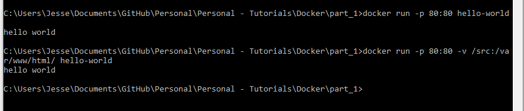
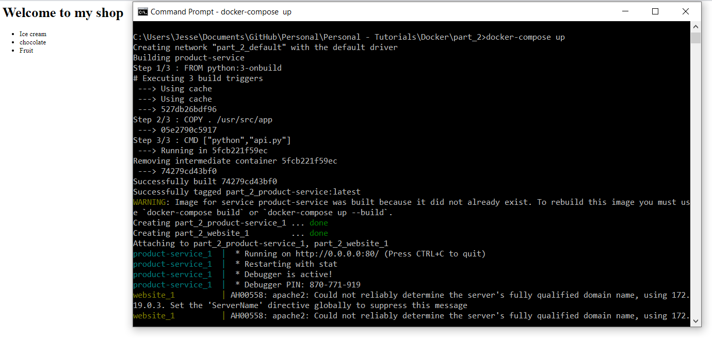

# Description
This tutorial consists of basic docker tutorials from youtuber 'Jake Wright'. It consists of a series of videos:
   * part_1: https://www.youtube.com/watch?v=YFl2mCHdv24
   * part_2: https://www.youtube.com/watch?v=Qw9zlE3t8Ko&t=1s
The series provides some of the basics of using Docker containers in app development. 

## Tools used:
   * Docker
   
## Methodology

## Result snapshot
   * part_1: 
   
   
   
   * part_2:	
   
   

