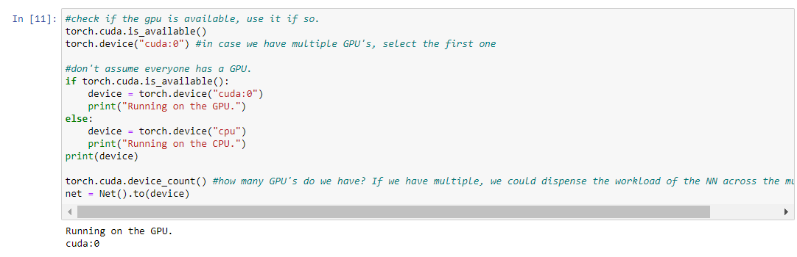
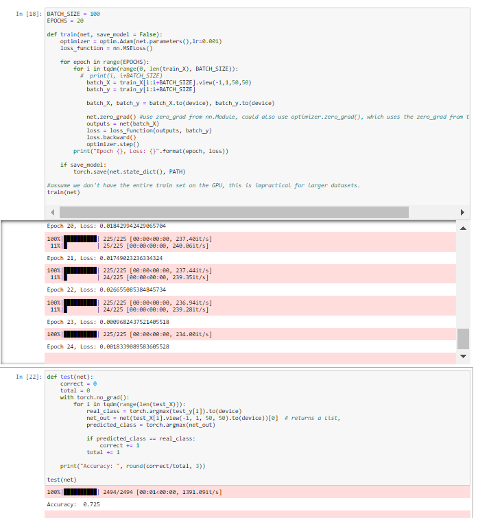
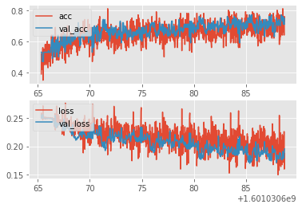
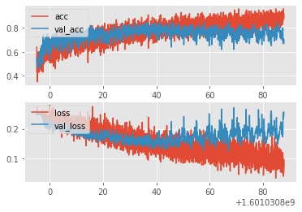
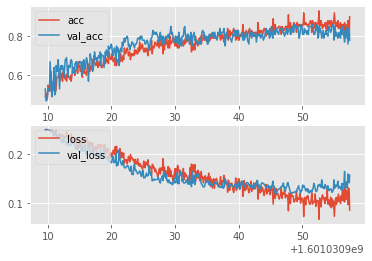

# Description
This tutorial consists of basic PyTorch tutorials. It consists of a series of videos:
   * part_1: https://www.youtube.com/watch?v=BzcBsTou0C0
   * part_2: https://www.youtube.com/watch?v=i2yPxY2rOzs
   * part_3: https://www.youtube.com/watch?v=ixathu7U-LQ
   * part_4: https://www.youtube.com/watch?v=9j-_dOze4IM
   * part_5: https://www.youtube.com/watch?v=9aYuQmMJvjA
   * part_6: https://www.youtube.com/watch?v=1gQR24B3ISE
   * part_7: https://www.youtube.com/watch?v=6gk7giKER6s&t=361s
   * part_8: https://www.youtube.com/watch?v=UuteCccDXCE&t=6s
The series provides the basics of using Pytorch.

## Tools used:
   * Python
   * PyTorch
   * GitHub
   * Docker
   
## Methodology

## Reproducing the results:
Note: the tutorial was followed on a windows machine, thus the steps might not translate 
1:1 to linux or MacOS. My apologies! Installment of docker is assumed. If this is not installed
on the machine, tutorials are widely available on the web; https://docs.docker.com/docker-for-windows/install/.
  
	* step 0: Change the directory in docker-compose.yml from C:/Users/Jesse/Documents/GitHub:/src/notebooks to [whatever_your_personal_directory_is]:/src/notebooks
	* step 1: Open the terminal.
	* step 2: Navigate to the directory including the Dockerfile and docker-compose.ylm, probably: cd ./Pytorch
	* step 3: docker build . -t custom_notebook [Note: this may take a few minutes!]
	* step 4: docker run -p 8888:8888 -v C:/Users/Jesse/Documents/GitHub/Personal/"Personal - Tutorials"/PyTorch:/src/notebooks -v C:/Users/Jesse/Documents/GitHub/data:/src/notebooks/data -t custom_notebook [Note: change C:/Users/Jesse/Documents/GitHub/Personal (contains the Pytorch tutorial repository) and C:/Users/Jesse/Documents/GitHub/data (contains the PetImages data) to your own relative directories!] 
	* step 5: paste the url to your browser of choice, I picked chrome.
	* step 6: import the jupyter notebook of choice.
Congratulations, you can now rerun the cells using the docker container!

Note: If you want to train the model on the GPU in part 7 and 8, I will refer you to the video link. The model resulting from my training (on a GPU) 
can be found in Pytorch/p7/model.pt. You can also use this if desired. In this case, skip the cell with the train() function!

## Result snapshot

   * part_7: Running on the GPU.
		* 
   
   * part_7: Model results in terms of score.
		* 
   
   * part_8: Model results visualized 1/3.
		* 
   
   * part_8: Model results visualized 2/3.
		* 
   
   * part_8: Model results visualized 3/3.
		* 

